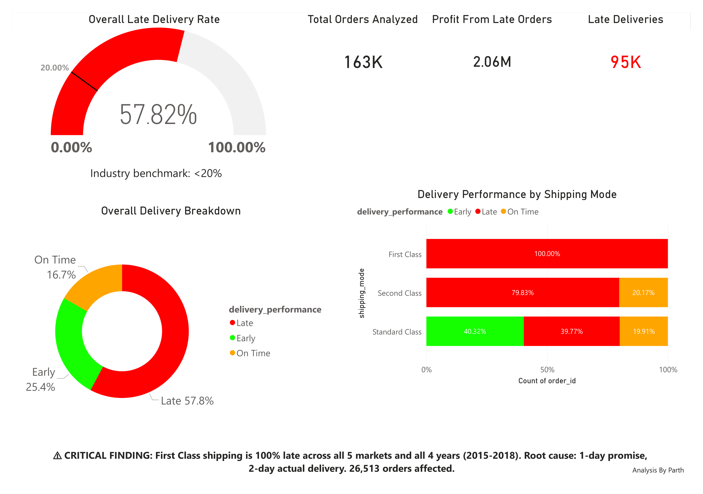
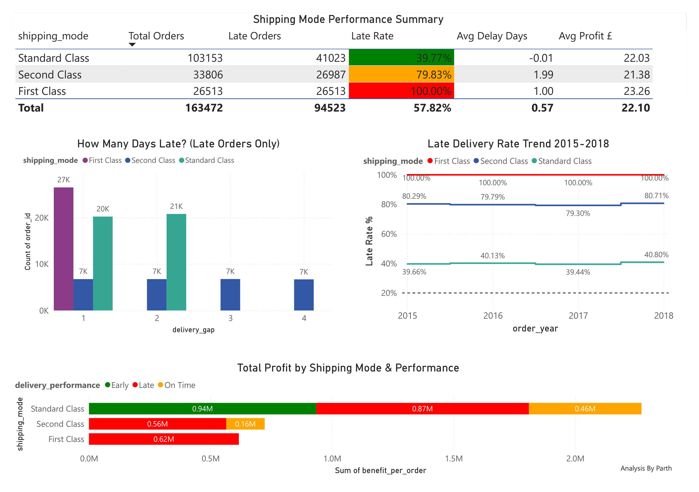

# Supply Chain Delivery Optimization
## E-Commerce Operations Analytics | 163,472 Orders | 2015-2018

---

## Project Overview

Analyzed a global e-commerce supply chain dataset to identify 
root causes of a 57.82% late delivery rate and quantify 
financial impact. Applied the Google Data Analytics 6-phase 
methodology (Ask, Prepare, Process, Analyze, Share, Act).

**The Core Finding:** First Class shipping promises 1-day 
delivery but physically takes 2 days — every single order, 
across all 5 global markets, for 4 consecutive years. 
This scheduling misconfiguration caused 26,513 unnecessary 
late deliveries and is fixable at zero operational cost.

**Also see:** [Project 1 — E-Commerce Customer Retention Analysis](https://github.com/Parth3030/ecommerce-customer-retention-analysis)
---

## Problem Statement

A global supply chain operation serving 5 markets (Africa, 
Europe, LATAM, Pacific Asia, USCA) across 3 customer segments 
(Consumer, Corporate, Home Office) was experiencing a 57.82% 
late delivery rate — nearly 3x the industry benchmark of 20%.

**Business Questions Answered:**
1. What is our current on-time delivery rate and financial impact?
2. Which shipping modes and markets have the highest late rates?
3. What is the root cause of delivery failures?
4. How much profit is being eroded by late deliveries?
5. What operational changes would have the highest ROI?

---

## Dataset

- **Source:** DataCo Supply Chain Dataset
- **Raw rows:** 180,520 orders
- **Cleaned rows:** 163,472 (after removing cancellations 
  and invalid records)
- **Date range:** 2015-2018
- **Markets:** Africa, Europe, LATAM, Pacific Asia, USCA
- **Shipping modes:** First Class, Second Class, Standard Class

**Cleaning decisions:**
- Separated 7,754 canceled orders into separate analysis
- Removed columns with >86% missing values (Order Zipcode)
- Removed 100% empty columns (Product Description)
- Added calculated columns: Delivery_Gap, Delivery_Performance, 
  Profit_Flag, Order_Year, Order_Month

---

## Key Findings

### Finding 1: First Class Shipping — Complete Failure
| Metric | Value |
|--------|-------|
| Late delivery rate | 100.00% |
| Orders affected | 26,513 |
| Years affected | 2015, 2016, 2017, 2018 |
| Markets affected | All 5 (Africa, Europe, LATAM, Pacific Asia, USCA) |
| Scheduled delivery promise | 1 day |
| Actual delivery time | 2 days |
| Root cause | Scheduling misconfiguration |

### Finding 2: Systemic Pattern Across All Segments
Late delivery rate variance across markets: only 0.97%
(Africa 57.47% to Europe 58.20%)

Late delivery rate variance across customer segments: only 0.46%
(LATAM 57.23% to Europe 58.20%)

This uniformity confirms the problem is operational/process-level,
not geographic or demographic.

### Finding 3: Second Class Routing Issues
- 79.83% late rate (26,987 orders)
- Delivery gaps of 1-4 days (vs First Class which is always exactly 1)
- Profit recovery potential: £62,070 if routing improved

### Finding 4: Same Day Shipping — Complete Cancellation
- 444 Same Day orders existed
- ~100% ended in cancellation (0 completed deliveries)
- Orders accepted and then canceled rather than fulfilled

### Finding 5: Financial Impact
| Delivery Type | Orders | Avg Profit/Order | Total Profit |
|--------------|--------|-----------------|-------------|
| On Time | 27,357 | £22.71 | £621,248 |
| Late | 94,523 | £21.75 | £2,055,765 |
| Early | 41,592 | £22.49 | £935,225 |

Profit erosion from late vs on-time: £0.96 per order
× 94,523 late orders = **£90,742 annual profit erosion**

---

## Tools Used

| Phase | Tool | Purpose |
|-------|------|---------|
| Ask + Prepare | Excel | Initial inspection, column audit |
| Process | Excel | Data cleaning, calculated columns |
| Analyze | PostgreSQL | 10 SQL queries for deep analysis |
| Share | Power BI | 4-page interactive dashboard |
| Act | Excel | Financial model, ROI calculations |

---

## SQL Analysis

10 queries covering:
- Overall delivery performance validation
- Shipping mode deep dive (late rate, avg delay, profit)
- Profit erosion calculation vs on-time baseline
- Market × shipping mode cross-analysis
- Department-level late delivery breakdown
- Scheduled vs actual days (root cause query)
- Year-over-year trend analysis
- Customer segment × shipping mode
- Delivery gap distribution by mode

All queries available in `/sql/` folder.

---

## Dashboard

4-page Power BI dashboard:

**Page 1: Executive Overview**
57.82% late rate gauge, KPI cards, performance donut, 
shipping mode 100% stacked bar, critical finding alert

**Page 2: Shipping Mode Deep Dive**
Mode comparison table, delivery gap distribution,
profit by mode, year-over-year trend lines

**Page 3: Market & Segment Analysis**
Market heatmap (uniform ~57% confirms systemic cause),
customer segment breakdown, department scatter plot

**Page 4: Recommendations**
Three actionable fixes with cost, impact, and ROI

---

### Dashboard Preview

**Page 1: Executive Overview**

**Page 2: Shipping Mode Deep Dive**

---

## Business Recommendations

### Recommendation 1: Fix First Class Scheduling (£0 cost)
**Action:** Update promised delivery window from 1 day to 2 days

**Impact:**
- 26,513 orders immediately reclassified as on-time
- Late rate drops from 57.82% to 41.60%
- Customer satisfaction improvement across all 5 markets
- Implementation time: 1 day

**Financial impact:** £61,683 annual benefit (customer retention)

---

### Recommendation 2: Audit Second Class Routing (£5,000 cost)
**Action:** Investigate routes producing 3-4 day gaps,
increase scheduled window by minimum 1 day

**Impact:**
- Convert 50% of late Second Class orders to on-time
- Profit recovery: £31,035 annually
- 13,494 customer experiences improved
- Implementation time: 4-6 weeks

**ROI: 521%**

---

### Recommendation 3: Suspend Same Day Shipping (£0 cost)
**Action:** Immediately suspend Same Day offering until
fulfillment capacity confirmed

**Impact:**
- Eliminates 100% cancellation rate for this tier
- Prevents customer trust damage and chargeback exposure
- Implementation time: Immediate

---

### Total Annual Impact
| Recommendation | Cost | Annual Benefit | ROI |
|---------------|------|---------------|-----|
| Fix First Class window | £0 | £61,683 | Infinite |
| Fix Second Class routing | £5,000 | £31,035 | 521% |
| Suspend Same Day | £0 | Risk mitigation | N/A |
| **Total** | **£5,000** | **£92,718** | **1,754%** |

---

## Files in This Repository

---

## Key Takeaway

A 57.82% late delivery rate sounds like a complex logistics 
problem requiring massive investment. The data revealed something 
different: one scheduling configuration error causing 26,513 
unnecessary late deliveries, fixable in a single day at zero cost.

This is what data analysis does — turns expensive-looking 
problems into cheap solutions.

---
*Analysis by Parth Parikh | Tools: Excel, PostgreSQL, Power BI*
*Dataset: DataCo Supply Chain | Google Data Analytics 6-Phase Methodology*
